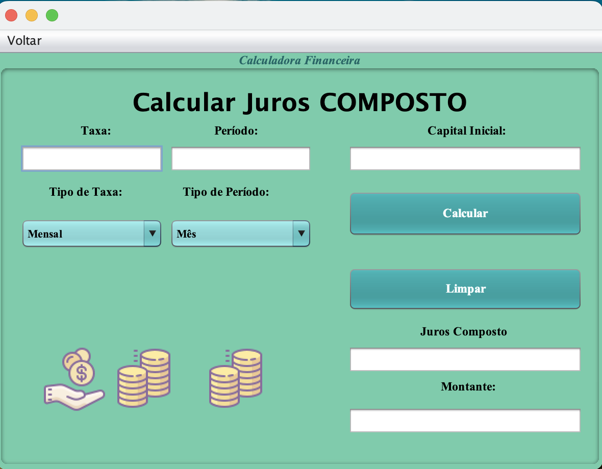
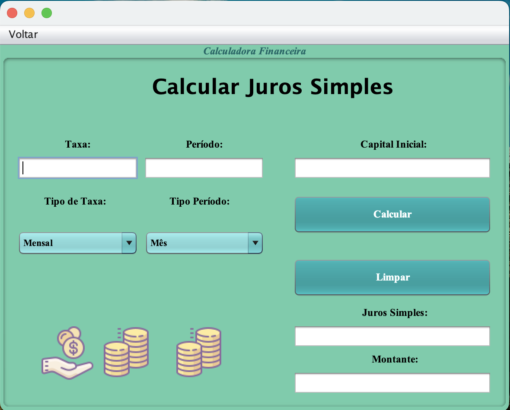
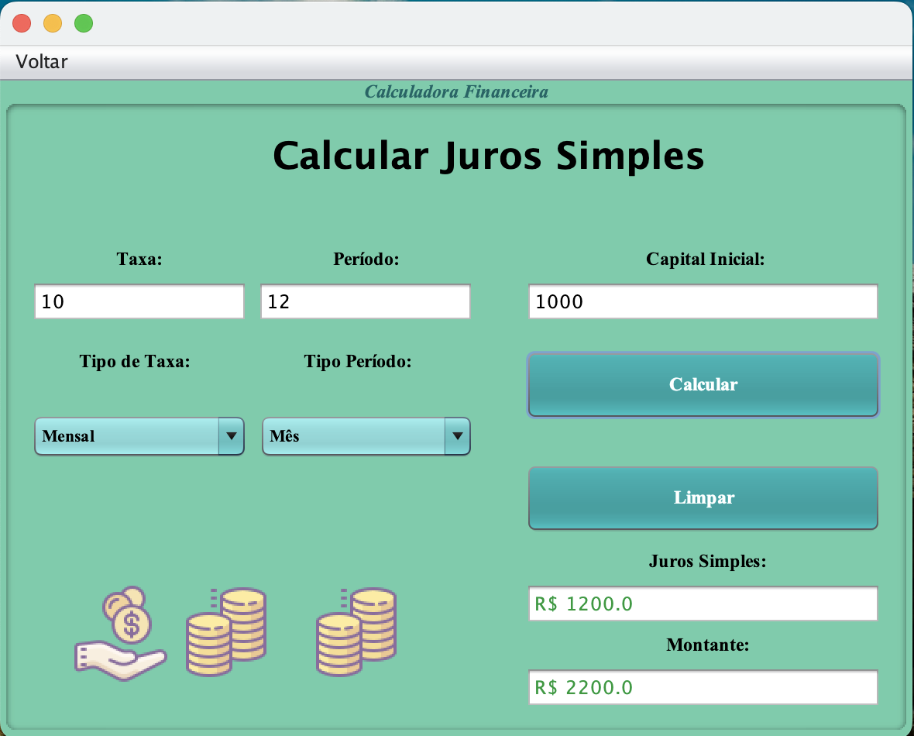
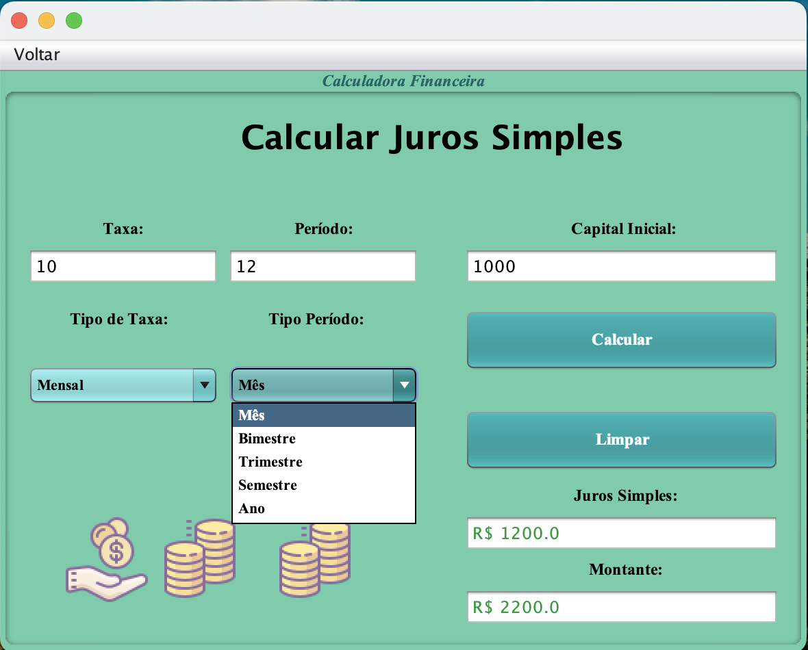
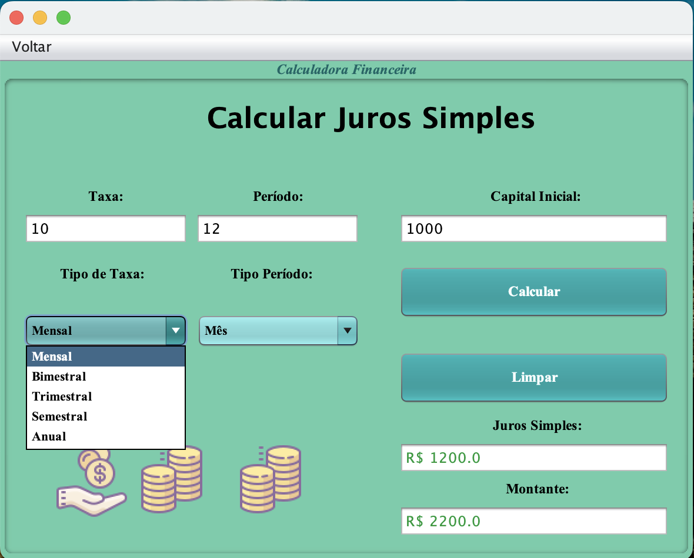
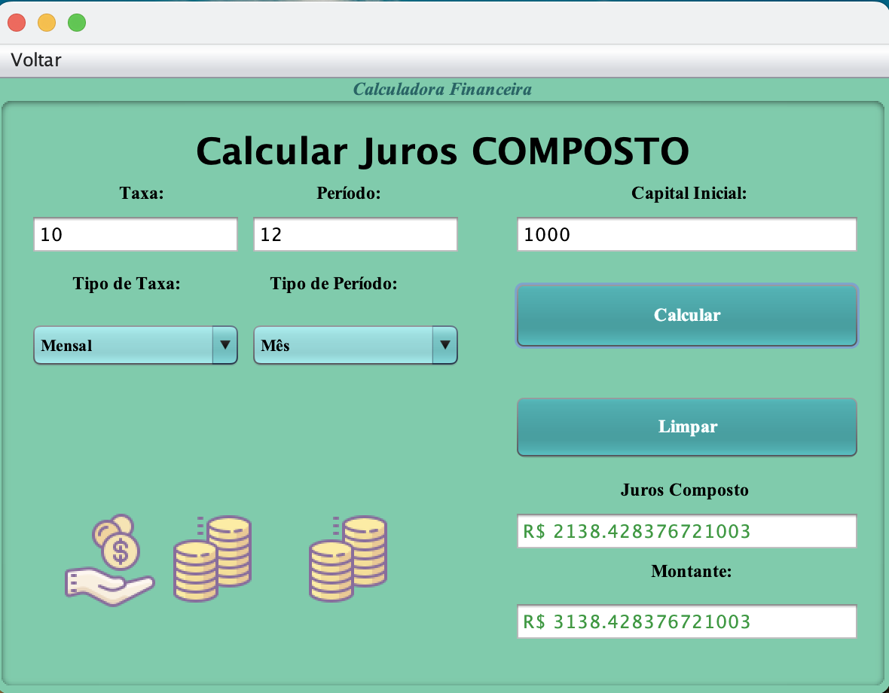
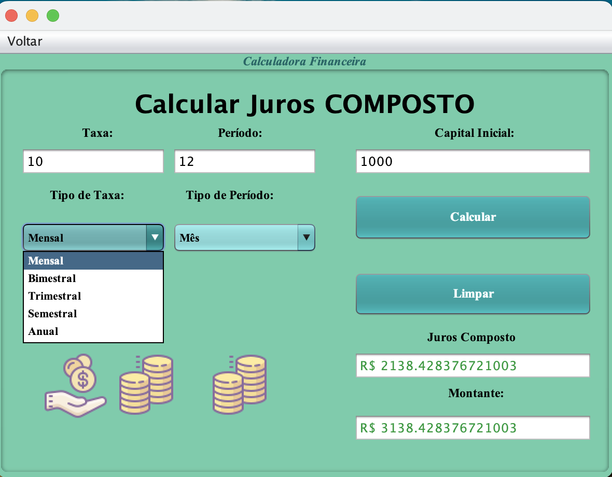
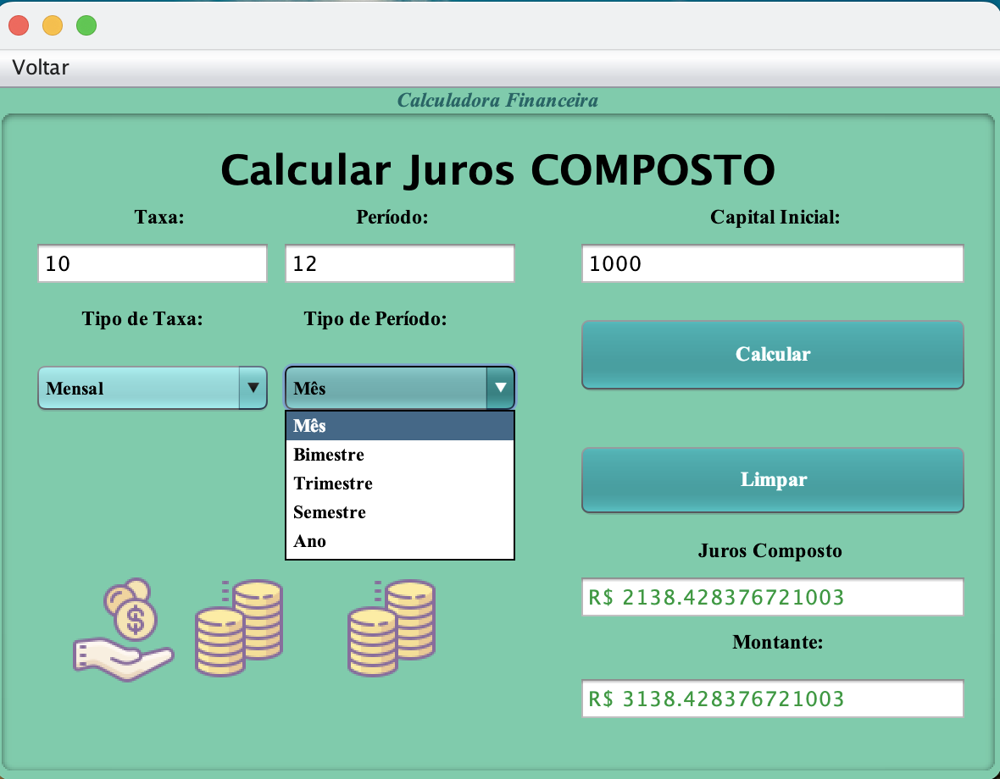

# Calculadora de Juros Simples/Compostos

## Descrição

Uma aplicação desktop simples desenvolvida em Java com o intuito de calcular juros simples e compostos.

## Status do Projeto

- **Concluído:** 2019

## Requisitos de Sistema


## Funcionalidades

- Tela inicial
- Tela de calcular juros simples
- Tela de calcular juros compostos

## Instalação e execução via terminal

Siga os passos abaixo para rodar o projeto via terminal:

1. Clone o repositório:
    ```sh
    git clone https://github.com/rafaelleonan/calculadora-juros-java.git
    ```
2. Navegue até o diretório src do projeto:
    ```sh
    cd calculadora-juros-java/src
    ```
3. Compile os arquivos java, utilizando javac:
    ```sh
    javac calcularjuros/*.java
    ```
4. Execute o projeto:
    ```sh
    java calcularjuros.TelaInicial
    ```
   
## Telas
<p>
  
  
  
  
  
  
  
  
  
</p>